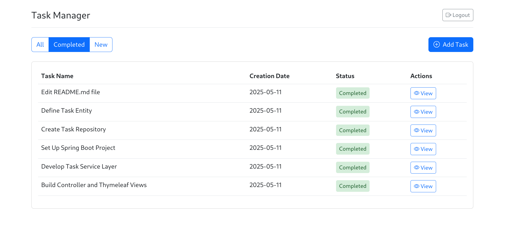
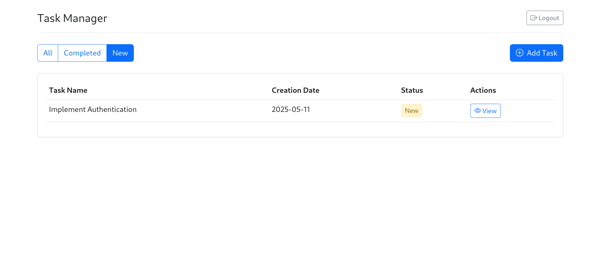
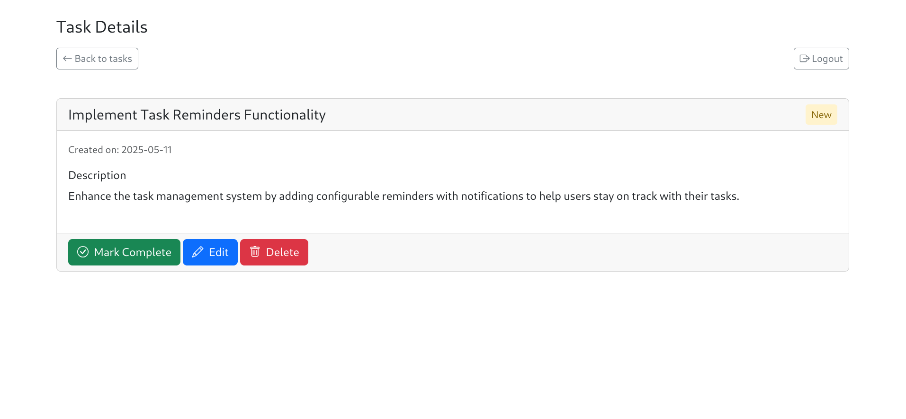

# Job4j Todo Application

This project is a simple Todo application built with Spring Boot, Hibernate, Thymeleaf, and PostgreSQL. It allows users to manage their tasks by creating, viewing, updating, and deleting them. The application follows a three-layer architecture (Controllers, Services, Persistence) and utilizes Liquibase for database schema management.

## Table of Contents

* [Features](#features)
* [Technologies Used](#technologies-used)
* [Getting Started](#getting-started)
    * [Prerequisites](#prerequisites)
    * [Installation](#installation)
    * [Running the Application](#running-the-application)
* [Database Schema](#database-schema)
* [Application Structure](#application-structure)
* [Configuration](#configuration)
* [Testing](#testing)
* [Screenshots](#screenshots)
* [Contact](#contact)

## Features

* **View All Tasks:** Displays a list of all tasks with their name, creation date, and status (done or not done).
* **Add New Task:** Provides a button to navigate to a page for creating new tasks.
* **Filter Tasks:** Offers links to filter tasks by:
    * **All:** Shows all tasks.
    * **Completed:** Shows only completed tasks.
    * **New:** Shows only pending tasks.
* **Task Details:** Clicking on a task in the list navigates to a page with a detailed description of the task.
* **Task Actions:** The task details page includes buttons for:
    * **Mark as Done:** Updates the task status to "completed".
    * **Edit:** Redirects to a page for editing the task details.
    * **Delete:** Removes the task and redirects back to the list of all tasks.
* **Edit Task:** A dedicated page for modifying the description of an existing task.

## Technologies Used

* **Java:** Programming language.
* **Spring Boot:** Framework for building stand-alone, production-grade Spring based Applications.
* **Hibernate:** Object-Relational Mapping (ORM) framework for database interaction.
* **Thymeleaf:** Java server-side template engine for web development.
* **PostgreSQL:** Relational database management system.
* **Maven:** Build automation tool.
* **Lombok:** Java library that reduces boilerplate code.
* **Liquibase:** Database schema change management tool.

## Getting Started

Follow these steps to get the application running on your local machine.

### Prerequisites

* **Java Development Kit (JDK) 17 or higher:** Make sure you have Java installed on your system. You can download it from [Oracle's website](https://www.oracle.com/java/technologies/javase-downloads.html) or use a distribution like [OpenJDK](https://openjdk.java.net/).
* **Maven:** Ensure Maven is installed. You can download it from [Apache Maven's website](https://maven.apache.org/download.cgi).
* **PostgreSQL:** You need a running instance of PostgreSQL. You can install it from [PostgreSQL's website](https://www.postgresql.org/download/).

### Installation

1.  **Clone the repository:**
    ```bash
    git clone <repository_url>
    cd job4j_todo
    ```

2.  **Configure Database:**
    * Create a database named `todo_db` (or any name you prefer) in your PostgreSQL instance.
    * Update the database connection properties in `src/main/resources/application.properties`. Replace the placeholders with your PostgreSQL username and password.

    ```properties
    spring.datasource.url=jdbc:postgresql://localhost:5432/todo_db
    spring.datasource.username=your_username
    spring.datasource.password=your_password
    spring.datasource.driver-class-name=org.postgresql.Driver
    ```

### Running the Application

1.  **Build the project:**
    ```bash
    mvn clean install
    ```

2.  **Run the application:**
    ```bash
    mvn spring-boot:run
    ```

Alternatively, you can run the generated JAR file:
```bash
  java -jar target/job4j_todo-1.0.jar
```

3.  **Access the application:**
    Open your web browser and navigate to `http://localhost:8080`.

## Database Schema

The database schema for the `tasks` table is managed by Liquibase and is defined in the `/db/changelog/db.changelog-master.xml` file. The `tasks` table has the following structure:

```sql
CREATE TABLE tasks (
   id SERIAL PRIMARY KEY,
   name TEXT,
   description TEXT,
   created TIMESTAMP,
   completed BOOLEAN
);
```

* `id`: Unique identifier for the task (auto-incrementing primary key).
* `name`: Title of the task.
* `description`: Text describing the task.
* `created`: Timestamp indicating when the task was created.
* `completed`: Boolean indicating whether the task is completed (`true`) or not (`false`).

Liquibase is configured in the `pom.xml` file to automatically create and update the database schema based on the changesets defined in the `/db/changelog` directory. The specific configuration file used by Liquibase is determined by the active Spring profile (`test` or `production`), as defined in the `<profiles>` section of the `pom.xml`.

### Application Structure

The application follows a three-layer architecture:

* **Controllers:** Located in the `src/main/java/ru/job4j/todo/controller` directory. These classes handle user requests and interact with the Service layer.
* **Services:** Located in the `src/main/java/ru/job4j/todo/service` directory. These classes contain the business logic of the application and interact with the Persistence layer.
* **Persistence:** Located in the `src/main/java/ru/job4j/todo/repository` directory. These classes are responsible for data access and interact with the database using Hibernate.

The `SessionFactory` is created as a Spring Bean in the main application class (`src/main/java/ru/job4j/todo/Main.java`) using the `@Bean` annotation. The `TaskStore` class receives the `SessionFactory` instance through its constructor, enabling database interactions.

### Configuration

The main application configuration is located in `src/main/resources/application.properties`. This file contains settings for the database connection, server port, and other Spring Boot properties.

Liquibase configuration is managed through property files specified in the Maven profiles:

* `db/liquibase_test.properties`: Used for the `test` profile (active by default).
* `db/liquibase.properties`: Used for the `production` profile.

These files typically contain properties like the database URL, username, password, and the location of the Liquibase changelog file.

### Testing

The project includes basic integration tests located in the `src/test/java/ru/job4j/todo` directory. These tests utilize `spring-boot-starter-test` and aim to verify the basic functionality of the application. You can run the tests using the following Maven command:
    
```bash
mvn test
```

### Screenshots

##### Main Page


##### Log in Page


##### Registration Page


##### All tasks


##### Completed tasks


##### New tasks


##### Add task


##### View task


##### Edit task


##### Delete task


### Contact

Email: vasiliy.krasov.job@gmail.com

Telegram: @krasobas

